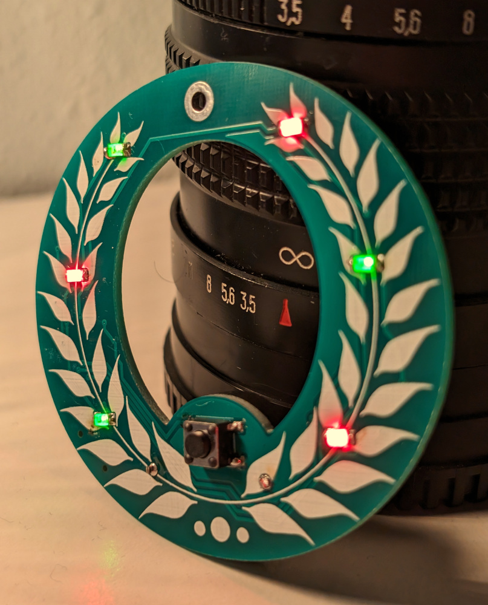

# Xmas Ornament 2023

An ATTiny404 LED Xmas tree ornament.

This year I waited until the last minute,
[and so this design is very derivative of last year's design.](https://github.com/Chris-Johnston/ornament2022)

## Resources used

- [svg2mod] was used to generate the footprint of the board, and the front silkscreen layer
  - I licensed a stock image for the front layer silkscreen
- I referred to [SerialUPDI] again as reference for getting UPDI working (and used the same adapter board from last year, apparently I had swapped +5V and GND somehow!?)
- [megaTinyCore] was used with Arduino (via the vscode Arduino extension) to upload to the ATTiny404

[svg2mod]: https://github.com/svg2mod/svg2mod
[SerialUPDI]: https://teddywarner.org/Projects/SerialUPDI/
[megaTinyCore]: https://github.com/SpenceKonde/megaTinyCore

## Bill of Materials

| Reference | Description | Part No. | Price |
| --------- | ----------- | -------- | ----- |
| PCB | | | $0.53 (+ $0.80 shipping because I did this late) |
| C1 | 1 uf 1206 capacitor | CL31B105KAHNNNE | $0.0534 |
| D1 - D6 | 1206 Bidirectional Red/Green LED | XZMDKVG55W-4 | $1.10 (0.1835 ea.) |
| R1 - R6 | 1206 47 ohm resistor | WR12X470 JTL | $0.06 ($0.0112 ea.)
| SW1 | 6x6mm Pushbutton | Generic | $0.05 |
| SW2 | Slide Switch | JS102011SAQN | $0.65 |
| U1 | Attiny404 | Attiny404-SSN | $0.59 |
| B1 | CR2023 Battery Holder | BH-25C-1 | $0.0785 |

Unit cost w/o shipping: $3.11

## Changes from last year's version

In 2021 I made [snowflake-ornament] and [2022 I made a tree ornament.](https://github.com/Chris-Johnston/ornament2022) This year doesn't have
many changes, other than a different footprint and one less LED.

One less LED fits better with this board layout, and also means that
each common I/O between the left and right side can use PWM.
Despite this, I didn't actually have time to implement anything which
uses the PWM, I was finishing the code the same day I was supposed to drop these off.

Since this was so rushed, the board layout had a few quirks and features. All of the LEDs but ONE face the same orientation,
and the back isn't very symmetric.
For the most part it all worked though.

[snowflake-ornament]: https://github.com/Chris-Johnston/snowflake-ornament